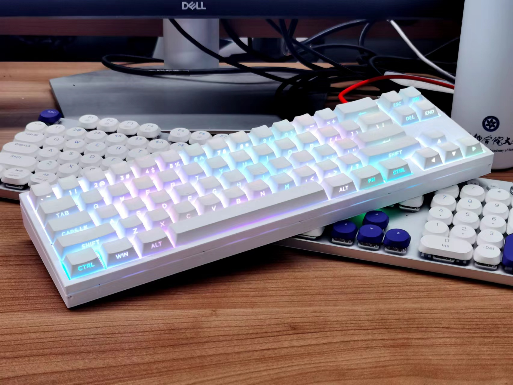

# MicroKeyBoard: An Open-Source, MicroPython-Based Firmware for Advanced Keyboard Customization

MicroKeyBoard is an open-source smart keyboard firmware architecture designed for diverse key-based input devices, leveraging the capabilities of MicroPython.

The increasing integration of advanced hardware (displays, encoders, etc.) in modern keyboards necessitates highly adaptable software support, as diverse user requirements often exceed standard manufacturer offerings. MicroKeyBoard addresses this via a flexible, MicroPython-based firmware **enabling users to directly modify the device's code**, often without the need for a full IDE. This facilitates the implementation of custom functionalities which can be packaged as **modular plugins for easy sharing and adoption within the community**. Furthermore, a novel direction explores leveraging **AI capabilities**, accessible directly on the device or via an external API, for **automatic code modification or generation** based on user requests, thereby enabling **self-updating firmware** and aiming to accelerate development cycles for new hardware and keyboard expansion modules, and foster community creativity.

Furthermore, evolving user interaction paradigms highlight a growing demand for multimodal input methods, such as voice command and gesture recognition. While traditional keyboard firmwares like QMK and ZMK are well-established and stable, they often lack the inherent flexibility and comprehensive support required for seamless integration of such advanced, intelligent functionalities. In response to these challenges and the evolving landscape of input interfaces, we have initiated this project to offer the community a novel intelligent keyboard firmware solution.

The project will provide comprehensive open-source software and modular hardware designs. It will officially support community-relevant functionalities such as musical input and voice integration, while fully preserve traditional keyboard features.

Currently in active development, we invite collaboration and evaluation from keyboard manufacturers, custom keyboard designers, and DIY enthusiasts. Interested parties are welcome to contact us to obtain **engineering samples free of charge**, as multiple units will be produced throughout the development process. The purpose of these samples is to **solicit community feedback** and to **provide hardware platforms for those interested in contributing to development**.

Previous CircuitPython implementation at [pyKeyboardOS](https://github.com/songxxzp/pyKeyboardOS).

## Supported Hardware:

### MCUs
Theoretically, any MicroPython-supported MCU (Make sure your board has a USB controller, BLE, and I2S if you want all features).
Currently developing and testing on ESP32-S3.
Planning for Raspberry Pi Pico 2 W.

### Designs
Currently, it supports shift register designs. Matrix scanning keyboards are not supported at the moment. However, implementing them should be straightforward with MicroPython. Please let us know if you need any features, and we will consider adjusting our development priorities accordingly.

## Features

- Shift Register
- Key Mapping
- USB
- BLE
- LED
- TFT Screen
- Piano

## RoadMap

- RGB Effects
- Full-key rollover HID
- Guided OTA
- WLAN
- MIDI
- SDCARD
- Matrix Scanning
- Plugin

## Versions

### 0318
- `/home/song/workspace/MicroKeyBoard/versions/0318/config`
- The ESP32S3 serves as the MCU, featuring shift register key panels and neopixel LEDs. It can be powered by either AAA or Li-ion batteries, but lacks onboard Li-ion chargers.

### 0413
- Developing

## Used Libs:
Download the following libraries and place them into the `lib` folder:

### [micropython-lib](https://github.com/micropython/micropython-lib)
- [usb](https://github.com/micropython/micropython-lib/tree/master/micropython/usb)

### [st7789py](https://github.com/russhughes/st7789py_mpy)
- [st7789py.py](https://github.com/russhughes/st7789py_mpy/blob/master/lib/st7789py.py)
- [vga2_bold_16x32.py](https://github.com/russhughes/st7789py_mpy/blob/master/romfonts/vga2_bold_16x32.py)

### [typing](https://github.com/Josverl/micropython-stubs)
- [typing.mpy](https://github.com/Josverl/micropython-stubs/blob/main/mip/typing.mpy)
- [typing_extensions.mpy](https://github.com/Josverl/micropython-stubs/blob/main/mip/typing_extensions.mpy)

### [micropython-ulab](https://github.com/v923z/micropython-ulab)
